# GPT Prompt Templates

[](https://github.com/phuchungbhutia/prompts-repo/stargazers) [](https://github.com/phuchungbhutia/prompts-repo/blob/main/LICENSE) [](https://github.com/phuchungbhutia/prompts-repo/actions) [](https://github.com/phuchungbhutia/prompts-repo/graphs/contributors) [](https://github.com/phuchungbhutia/prompts-repo/commits/main)

This repository contains a collection of GPT prompt templates organized by category, with automated indexing via GitHub Actions.

## Repository Stats


## Repository Structure

```mermaid
graph TD
    A[prompts-repo] --> B[prompts]
    A --> C[scripts]
    A --> D[.github/workflows]
    A --> E[docs/images]
    B --> CAT1[AI-Tools]
    B --> CAT2[Audit]
    B --> CAT3[Business]
    B --> CAT4[Career]
    B --> CAT5[Content-Creation]
    B --> CAT6[Content-Generation]
    B --> CAT7[Creativity]
    B --> CAT8[Data-Analysis]
    B --> CAT9[Deepseek]
    B --> CAT10[Design]
    B --> CAT11[Education]
    B --> CAT12[Excel]
    B --> CAT13[Fun]
    B --> CAT14[Health]
    B --> CAT15[Learning]
    B --> CAT16[Marketing]
    B --> CAT17[Multi-Disciplinary Guidance]
    B --> CAT18[Office]
    B --> CAT19[Productivity]
    B --> CAT20[Programming]
    B --> CAT21[Prompting]
    B --> CAT22[SEO]
    B --> CAT23[Writing]
    C --> S[update_index.py]
    D --> W[update-index.yml]
    E --> I[indexing.png]
    A --> R[README.md]
    A --> T[categories.md]
```



## Prompt Categories

| Category     | Description                              | Example Prompt              |
|--------------|------------------------------------------|-----------------------------|
| AI-Tools | Prompts for AI Tools  | Boost Productivity with These Powerful ChatGPT Prompts |
| Audit | Prompts for Audit  | Audit Observations |
| Business | Prompts for Business  | 9 ChatGPT Prompts to Find Profitable Market Opportunities |
| Career | Prompts for Career  | Comprehensive Career and Professional Development Prompts |
| Content-Creation | Prompts for Content Creation  | 18 ChatGPT Prompts for Content Creation |
| Content-Generation | Prompts for Content Generation  | 18 ChatGPT Prompts for User Experience |
| Creativity | Prompts for Creativity  | Comprehensive Brainstorming Prompts |
| Data-Analysis | Prompts for Data Analysis  | Example Prompts for Data Analysis with ChatGPT |
| Deepseek | Prompts for Deepseek  | Deepseek prompts |
| Design | Prompts for Design  | Create a 3D Kawaii-Style Canvas with Chibi Stickers |
| Education | Prompts for Education  | ChatGPT Prompts for Learning and Development |
| Excel | Prompts for Excel  | Advanced Excel Skill Mastery Using AI Prompts |
| Fun | Prompts for Fun  | Creative Prompts for Entertainment and Storytelling |
| Health | Prompts for Health  | Create a Comprehensive Healthy Meal Plan Guide |
| Learning | Prompts for Learning  | 10 Powerful AI-Based Learning Techniques |
| Marketing | Prompts for Marketing  | 18 ChatGPT Prompts for Advertising |
| Multi-Disciplinary Guidance | Prompts for Multi Disciplinary Guidance  | Creative and Comprehensive Prompt Ideas |
| Office | Prompts for Office  | Actionable Prompts for Government Officers and Auditors |
| Productivity | Prompts for Productivity  | 5 Problem-Solving Method Prompts for Founders & CEOs |
| Programming | Prompts for Programming  | 10 Useful ChatGPT Prompts for Developers |
| Prompting | Prompts for Prompting  | 12 Must-Know ChatGPT Prompt Techniques |
| SEO | Prompts for SEO  | 18 ChatGPT Prompts for SEO |
| Writing | Prompts for Writing  | Advanced Content Optimization and Writing Prompts |

## Prompts

- [10 Powerful AI-Based Learning Techniques](prompts/learning/ai-based-learning.md) - Master any topic faster with these 10 optimized prompt templates designed to enhance understanding, retention, and motivation.
- [10 Powerful AI-Based Learning Techniques for Mastering Any Topic](prompts/learning/ai-learning.md) - This guide explains 10 AI-based learning techniques to make mastering any topic faster and easier. Each technique includes use cases, examples, prompt templates, and optimized prompts for direct implementation.
- [10 Useful ChatGPT Prompts for Developers](prompts/app-development/software-development2.md) - A detailed guide to 10 essential ChatGPT prompts designed to assist developers in various aspects of software development, including coding, debugging, API design, database management, and learning best practices.
- [12 Must-Know ChatGPT Prompt Techniques](prompts/AITools/chatgpt.md) - Learn how to use 12 powerful ChatGPT prompt techniques with 36 ready-to-use examples for better results in learning, creativity, productivity, and problem-solving.
- [18 ChatGPT Prompts for Advertising](prompts/Business/advertising.md) - A collection of prompts for crafting impactful advertising campaigns, scripts, and strategies tailored to any product or audience.
- [18 ChatGPT Prompts for Content Creation](prompts/content-generator/content-creation.md) - A versatile collection of ChatGPT prompts to help create compelling content for blogs, videos, emails, and more.
- [18 ChatGPT Prompts for Digital Marketing](prompts/Business/digital-marketing.md) - A curated collection of prompts to assist digital marketers in creating content for multiple platforms, from social media posts to email sequences.
- [18 ChatGPT Prompts for SEO](prompts/content-generator/seos.md) - A set of advanced prompts to streamline SEO tasks, from meta descriptions to content gap analysis and keyword research.
- [18 ChatGPT Prompts for Social Media Marketing](prompts/content-generator/social-media.md) - A collection of expert prompts for creating engaging social media content across platforms and formats.
- [18 ChatGPT Prompts for User Experience](prompts/content-generator/ux.md) - A curated set of prompts to enhance user experience design and research efforts for applications, websites, and platforms.
- [5 Problem-Solving Method Prompts for Founders & CEOs](prompts/AITools/5tools.md) - Practical ChatGPT prompts for applying five strategic problem-solving frameworks—Pre-Mortem, 5 Whys, Decision Tree, SWOT, and Impact vs Effort Matrix.
- [50 Prompts for Extracting Text from PDF Tables Using Excel, Power Query, and Python](prompts/app-development/data-extraction.md) - A comprehensive guide with 50 prompts to extract text from tables in multiple PDF files using Excel, Power Query, and Python. This includes formula-based, automated, and code-driven approaches for handling complex data structures.
- [9 ChatGPT Prompts to Find Profitable Market Opportunities](prompts/Business/Market.md) - Discover 9 powerful ChatGPT prompts to uncover hidden market opportunities, along with 3 real-world examples for each to help spark your next venture.
- [Actionable Prompts for Government Officers and Auditors](prompts/AITools/prompts3.md) - A collection of role-based prompts designed to assist government officers and auditors in structured decision-making and effective task execution.
- [Advanced Affiliate Marketing, Brand Collaborations & YouTube Ads Optimization](prompts/Business/affiliate1.md) - A collection of structured prompts designed to help YouTube creators maximize earnings through affiliate marketing, brand partnerships, and ad revenue optimization.
- [Advanced Content Optimization and Writing Prompts](prompts/Productivity/content.md) - A curated list of refined prompts designed to enhance clarity, emotional resonance, audience engagement, and creative ideation for writing projects.
- [Advanced Excel Skill Mastery Using AI Prompts](prompts/excel/excel.md) - A curated list of prompts tailored to leverage AI tools for mastering Excel functionality, including formula creation, data cleaning, visualization, and automation.
- [Advanced SEO Strategies and Content Optimization Prompts](prompts/content-generator/seo-prompt.md) - A collection of actionable SEO prompts to enhance content strategy, search rankings, and overall site performance.
- [Advanced Writing and Content Optimization Prompts](prompts/Productivity/content1.md) - A curated set of prompts designed to refine content, enhance emotional resonance, tailor messaging for specific audiences, and generate fresh ideas.
- [Advanced Writing Optimization & Engagement Prompts](prompts/AITools/copywriting.md) - A structured collection of prompts designed to refine writing clarity, enhance engagement, and optimize content for SEO and social media growth.
- [Advanced YouTube Growth & Monetization Strategy](prompts/Business/youtube2.md) - A structured collection of prompts designed to optimize YouTube monetization, enhance branding, boost engagement, and refine audience growth strategies.
- [Advanced YouTube Growth, Algorithm Hacking & Collaboration Strategies](prompts/Business/youtube3.md) - A structured set of prompts designed to maximize audience engagement, optimize content for YouTube's algorithm, and build strategic collaborations with creators.
- [AI Productivity Prompts for Optimization & Efficiency](prompts/Productivity/productivity4.md) - A structured collection of AI prompts designed to refine goal setting, time management, workflow automation, and problem-solving efficiency.
- [AI-Powered YouTube Video Script Generator](prompts/content-generator/youtube-script.md) - This prompt is designed for content creators, marketers, and YouTubers who want to generate engaging and well-structured scripts for YouTube videos using AI.
- [Audit Observations](prompts/audit/observations.md) - Prompt for Writing Audit Observations
- [Best ChatGPT Prompts for Writing](prompts/Academics/writing.md) - A collection of structured prompts for generating high-quality writing across various formats, including blog posts, proposals, cover letters, and creative storytelling.
- [Blog Post Generator](prompts/content-generator/blog-post-generator.md) - Generates outlines and content for blog posts based on given topics
- [Boost Productivity with These Powerful ChatGPT Prompts](prompts/AITools/productivity.md) - Learn how to maximize your productivity in 2025 using ChatGPT prompts. This blog breaks down the structure, examples, and best practices to make ChatGPT your ultimate task partner.
- [Boosting Productivity with ChatGPT](prompts/Productivity/booster.md) - A curated collection of prompts and strategies to optimize productivity using ChatGPT for professionals, students, and entrepreneurs.
- [Boosting Productivity with ChatGPT](prompts/Productivity/productivity-chatgpt.md) - A curated collection of prompts and strategies to optimize productivity using ChatGPT for professionals, students, and entrepreneurs.
- [Builder-to-Brand Gameplan - Brutal Focus Roadmap](prompts/Productivity/productivity.md) - A comprehensive 4-stage roadmap designed to align your multi-talented brain with ruthless execution, helping you transition from a "Builder" to a memorable "Brand." This plan ensures clarity, focus, and scalable growth.
- [ChatGPT Cheat Sheet - Crafting Effective Prompts](prompts/AITools/chatgpt-cheatsheet.md) - A detailed guide on using structured prompts to maximize ChatGPT’s potential across various domains, including content creation, coding, sales, marketing, and personal career development.
- [ChatGPT for Marketing](prompts/AITools/marketing.md) - A comprehensive guide to using ChatGPT for 10 powerful marketing tasks—from campaign planning to SEO content ideas—complete with optimized prompts, use cases, and real-world examples.
- [ChatGPT Prompt Cheatsheet for Various Use Cases](prompts/AITools/chagpt2.md) - This cheatsheet provides beginner-friendly ChatGPT prompts to explain, learn, brainstorm, and solve problems across multiple use cases.
- [ChatGPT Prompt Frameworks for Effective Task Structuring](prompts/Productivity/prompt-framework.md) - This document outlines five structured frameworks to craft ChatGPT prompts for effective task execution. Each framework is explained with its structure, purpose, and practical examples for various use cases like business, content creation, education, and personal growth.
- [ChatGPT Prompt Frameworks – Full Guide with Examples](prompts/AITools/chatgpt-frameworks.md) - Learn to master ChatGPT using 5 powerful prompt frameworks—R-T-F, T-A-G, B-A-B, C-A-R-E, and R-I-S-E. Each structure includes explanations, ideal use cases, and real-world prompt examples for getting actionable, relevant outputs from ChatGPT.
- [ChatGPT Prompt Guide](prompts/content-generator/prompts.md) - A comprehensive guide to crafting effective ChatGPT prompts for optimal outputs, including foundational strategies and advanced techniques.
- [ChatGPT Prompt Guide for Structured Usage](prompts/AITools/chatgpt3.md) - This guide provides a comprehensive explanation and examples of structured prompts to use ChatGPT effectively. It covers various roles, techniques, and use cases to help users optimize their interactions and generate precise responses.
- [ChatGPT Prompting Frameworks Explained](prompts/AITools/frameworks.md) - Learn how to unlock the full potential of ChatGPT using four powerful prompting frameworks—RTF, BAB, CAR, and TARG. Includes examples, use cases, pros, cons, and limitations.
- [ChatGPT Prompts for Building a GST Audit Tool](prompts/audit/gst-audit-tool.md) - Leverage ChatGPT to create tailored prompts for automating GST audit processes, analyzing data, detecting revenue leakages, and streamlining reporting. These prompts are categorized for different aspects of the development process.
- [ChatGPT Prompts for Data Science](prompts/app-development/data-science.md) - A versatile set of prompts to tackle tasks in data science, including modeling, visualization, and cleaning.
- [ChatGPT Prompts for Learning and Development](prompts/learning/learn-develop.md) - A versatile collection of prompts to enhance learning and development initiatives through creative instructional design, assessments, and engagement strategies.
- [ChatGPT Prompts for Producing Your Ebook Manuscript](prompts/content-generator/manuscript.md) - A comprehensive guide to using ChatGPT for crafting an engaging and market-ready ebook, covering everything from back cover descriptions to manuscript creation and graphics.
- [ChatGPT Prompts for Software Development](prompts/app-development/sw-develop.md) - A versatile collection of prompts to assist with software development, from architecture and testing to documentation and code improvement.
- [ChatGPT Prompts for Teaching](prompts/Academics/teaching.md) - A comprehensive collection of prompts to assist educators in lesson planning, classroom management, and student engagement.
- [ChatGPT Prompts for Writing a Book](prompts/content-generator/book-writer.md) - A detailed collection of ChatGPT prompts to assist authors in various stages of book writing, from outlining to character development and marketing strategies.
- [ChatGPT Prompts for Writing an Ebook](prompts/content-generator/ebooks.md) - A versatile collection of prompts that guide authors through the ebook writing process, from ideation to proofreading and marketing.
- [Cheat Sheet for Crafting Effective ChatGPT Prompts](prompts/AITools/chatgpt4.md) - This cheat sheet provides a structured approach to writing effective ChatGPT prompts using roles, tasks, formats, linked prompting, and prompt priming techniques. Enhance precision, clarity, and actionable responses through these frameworks.
- [Community Building, Livestream Monetization & Brand Sponsorship Outreach](prompts/Business/live.md) - A collection of prompts designed to strengthen audience loyalty, optimize livestream monetization, and craft high-impact brand sponsorship outreach strategies.
- [Community-Driven Monetization, Influencer-Led AI Experiences & Referral-Based Business Scaling](prompts/Business/monet.md) - A structured collection of prompts designed to optimize community-based monetization models, influencer-led AI experiences, and scalable referral-driven growth.
- [Comprehensive Affiliate Marketing Prompts](prompts/Business/affiliate.md) - A curated list of prompts designed for effective planning, campaign optimization, and compliance in affiliate marketing across various niches.
- [Comprehensive AI Prompt Framework](prompts/AITools/prompts5.md) - A detailed and structured approach to crafting effective AI prompts for diverse tasks, ensuring thorough, insightful, and actionable responses.
- [Comprehensive and Detailed Prompt Frameworks](prompts/content-generator/framework.md) - A set of five step-by-step prompts tailored for specific fields, crafted to inspire precision, creativity, and actionable insights.
- [Comprehensive and Inspired Prompts Across Themes](prompts/AITools/prompts6.md) - An array of prompts designed to inspire detailed and innovative responses, spanning development, finance, creative writing, and motivational guides.
- [Comprehensive Brainstorming Prompts](prompts/Academics/brainstorm.md) - Detailed prompts to utilize brainstorming frameworks and techniques for generating innovative ideas.
- [Comprehensive Business Strategy Prompts](prompts/Business/business.md) - A refined collection of business strategy prompts designed to guide industry analysis, competitive differentiation, operational efficiency, and innovation.
- [Comprehensive Business Strategy Prompts](prompts/Business/business2.md) - A refined collection of business strategy prompts designed to guide industry analysis, competitive differentiation, operational efficiency, and innovation.
- [Comprehensive Career and Professional Development Prompts](prompts/Career-Tips/career2.md) - A structured list of prompts designed to refine resumes, optimize cover letters, prepare for interviews, and strengthen career strategies.
- [Comprehensive Career Development & Professional Growth Prompts](prompts/Career-Tips/career.md) - A structured collection of prompts designed to refine resumes, optimize cover letters, prepare for interviews, and strengthen networking strategies.
- [Comprehensive Freelance Pricing and Rate Calculation Prompts](prompts/Business/pricing.md) - A structured collection of prompts to help freelancers determine pricing, create value-based packages, and benchmark rates against industry standards.
- [Comprehensive Guide to Creating an eBook from Online Sources](prompts/content-generator/ebook.md) - This document provides a clear process for creating an engaging eBook by extracting information from a specified web URL. It focuses on structuring content, targeting specific audiences, and implementing cohesive design elements to ensure a seamless reading experience.
- [Comprehensive Learning Prompts](prompts/Productivity/learning.md) - A structured list of prompts for effective learning across various skills, tailored for coaching, resource curation, accelerated acquisition, and practical application.
- [Comprehensive List of Prompt Types with Examples](prompts/learning/prompts.md) - A categorized set of prompts to effectively guide conversations and outputs with AI across various contexts.
- [Comprehensive Marketing and Content Prompt Guide](prompts/Business/marketing.md) - A curated collection of 50 versatile prompts tailored for marketing campaigns and content creation, designed to enhance creativity and strategic execution.
- [Comprehensive Marketing Prompts](prompts/Business/marketing2.md) - A collection of versatile prompts for optimizing marketing efforts, from campaign planning to creative content generation.
- [Comprehensive Prompt for Maximizing Free AI Tools](prompts/AITools/tools.md) - A structured guide for effectively using free AI tools to achieve creative, professional, and research goals.
- [Comprehensive Prompt Guide for Authors](prompts/content-generator/ebook-writer.md) - A versatile collection of prompts tailored for authors to enhance book outlining, character development, plot troubleshooting, and more.
- [Comprehensive Prompt Guide for Strategic and Creative Tasks](prompts/learning/creative.md) - A detailed collection of actionable prompts to support strategic analysis, marketing initiatives, project planning, content creation, and personal development.
- [Comprehensive Prompt Ideas for Productivity and Growth](prompts/AITools/prompt4.md) - A diverse list of prompts aimed at boosting productivity, mastering routines, and fostering healthy habits, tailored to creators, entrepreneurs, and lifelong learners.
- [Comprehensive Prompt Ideas for Productivity and Growth](prompts/Productivity/productivity1.md) - A diverse list of prompts aimed at boosting productivity, mastering routines, and fostering healthy habits, tailored to creators, entrepreneurs, and lifelong learners.
- [Comprehensive Prompts for Copilot Use Cases](prompts/content-generator/copilot.md) - Detailed prompts for leveraging Copilot features effectively, tailored to scenarios ranging from web browsing and mobile productivity to advanced data analysis and email assistance.
- [Comprehensive Resume Optimization & Job Interview Prompts](prompts/Career-Tips/resume.md) - A structured collection of prompts to refine resumes, enhance interview readiness, identify skills gaps, and frame weaknesses strategically.
- [Comprehensive Role-Based Prompt Frameworks](prompts/AITools/prompts.md) - An extensive list of prompts designed to help users tackle tasks in various professional, creative, technical, and community-oriented roles.
- [Comprehensive Sales & Marketing Prompt Guide](prompts/Business/sales-strategy.md) - A collection of prompts to create impactful sales and marketing strategies, engaging content, and actionable plans to overcome challenges.
- [Comprehensive Stock Trading & Investment Strategy Prompts](prompts/Business/stocks.md) - A structured collection of prompts designed to refine stock market analysis, risk management strategies, portfolio diversification, and fundamental investing insights.
- [Comprehensive Thesis Chapter Prompts](prompts/Academics/research-academics.md) - Detailed prompts for guiding the creation of each thesis chapter, from introduction to references.
- [Crafting Captivating Product Descriptions for eCommerce](prompts/Business/eCommerce.md) - A step-by-step framework for creating persuasive product descriptions that resonate with customers and maximize conversions.
- [Create a 3D Kawaii-Style Canvas with Chibi Stickers](prompts/content-generator/stickers.md) - A creative prompt to generate a 3D kawaii-style canvas in A4 size featuring chibi stickers with unique expressions and fun phrases.
- [Create a Comprehensive Healthy Meal Plan Guide](prompts/health-nutrition/nutrition-expert.md) - Acts as a nutrition expert to create a detailed, multi-diet meal planning guide with sample meals, tips, and substitutions.
- [Creative and Comprehensive Prompt Ideas](prompts/AITools/prompts2.md) - A detailed and diverse collection of prompts following the format "Act as [Role], perform [Task] in [Format]" to inspire creativity, utility, and practical execution across industries and professions.
- [Creative Prompts for Entertainment and Storytelling](prompts/learning/fun.md) - A diverse collection of prompts to inspire humor, storytelling, and imaginative activities across multiple themes.
- [Critical Thinking Prompt Template](prompts/learning/critical-thinking.md) - This template guides users in developing deeper understanding and applying higher-order thinking to analyze, evaluate, and create ideas based on specific topics. Organized into six distinct levels of thought, each section is designed to enhance learning and intellectual engagement.
- [Cross-Platform Audit App Development Plan](prompts/app-development/audit-app.md) - Prompt for generating a comprehensive development plan for a free, cross-platform mobile and web app for auditors using open-source tools and AI coding assistants.
- [Customer Journey Mapping, Influencer Affiliate Strategies & Subscription Model Growth](prompts/Business/affiliate2.md) - A structured collection of prompts designed to refine customer journey experiences, influencer-driven affiliate strategies, and recurring revenue through subscription models.
- [DeepSeek AI Prompt Hacks Cheat Sheet](prompts/AITools/deepseek.md) - A comprehensive cheat sheet of DeepSeek AI prompt hacks with categorized examples to help you create powerful AI-generated content, resumes, code, educational material, and more.
- [DeepSeek Cheat Sheet - AI Prompts for Skill Building, Business & Productivity](prompts/AITools/deepseek2.md) - A detailed guide to using DeepSeek AI for skill development, business consulting, content creation, writing improvement, productivity, and more—featuring ready-to-use prompts and examples.
- [Deepseek prompts](prompts/deepseek/2025.04.18.md) - Collection of Deepseek prompts
- [Detailed Prompts and AI Tools for Impactful Content and Problem Solving](prompts/Business/sales.md) - A comprehensive guide to creating tailored prompts for diverse challenges, paired with AI tools to amplify results.
- [Developer Prompts for Productivity and Clarity](prompts/app-development/software-development.md) - A set of detailed prompts to guide developers in specific scenarios, ensuring maximum efficiency and clear outcomes.
- [eBook Writing Prompts That Sell](prompts/content-generator/ebooks-that-sell.md) - A set of tailored prompts to create captivating eBook titles, effective structures, and engaging chapters that resonate with readers.
- [Educator's Prompt Guide for Classroom Excellence](prompts/Academics/education.md) - A comprehensive list of prompts designed to inspire and empower educators in classroom management, lesson planning, student engagement, and progress monitoring.
- [Effective ChatGPT Prompts for Creating User Manuals](prompts/content-generator/manuals.md) - A guide with prompts and strategies to leverage ChatGPT for creating clear, user-friendly technical manuals.
- [Email Marketing Funnels, Digital Product Launches & Influencer Sponsorship Strategies](prompts/Business/marketing3.md) - A structured collection of prompts designed to help YouTube creators monetize through email marketing, digital product launches, and influencer brand partnerships.
- [Enhanced Productivity and Creativity Prompts with ChatGPT](prompts/Productivity/creative.md) - A collection of practical and creative prompts tailored to boost productivity, streamline workflows, and unlock creativity using ChatGPT.
- [Enhanced Writing Prompts](prompts/content-generator/contents.md) - A detailed and comprehensive set of prompts to elevate writing projects across various domains.
- [Essential ChatGPT Prompts for Technical Documentation](prompts/content-generator/technical-documentation.md) - A curated collection of prompts for creating comprehensive, user-friendly technical documents with ChatGPT.
- [Essential Travel Planning Prompts](prompts/content-generator/travel.md) - A curated set of prompts designed for seamless trip planning, including flights, accommodations, itineraries, local transport, and must-try experiences.
- [Ethical AI Use in Academic Writing – Prompts & Guide](prompts/Academics/academics.md) - A complete guide and prompt collection for using AI tools ethically in academic writing. Includes detailed steps, do’s and don’ts, and professional prompt templates.
- [Example Prompts for Data Analysis with ChatGPT](prompts/Data-analysis/chatgpt-data-analysis.md) - This document presents example prompts for utilizing ChatGPT to analyze research data effectively. Each prompt is tailored to specific data-related tasks, ensuring thorough and structured analysis.
- [Expanded AI Prompts for Digital Product Creation](prompts/Business/digital-product.md) - A refined collection of prompts designed to streamline the digital product creation process, including ideation, validation, content generation, and sales strategy.
- [Expanded Role-Based Prompts for Professionals](prompts/AITools/prompts1.md) - A detailed list of prompts designed for diverse professional roles, offering actionable tasks with structured formats for maximum clarity and impact.
- [Expanded Skill-Specific Learning Prompts](prompts/Productivity/skills.md) - A structured list of prompts for effective learning across various skills, tailored for coaching, resource curation, accelerated acquisition, and practical application.
- [Expanded Writing and Content Optimization Prompts](prompts/Productivity/creative1.md) - A refined collection of prompts designed to enhance clarity, emotional resonance, audience engagement, and generate innovative content ideas.
- [Fictional Character Technical Advisor Prompt](prompts/content-generator/fiction.md) - A structured guide to assist fiction writers in crafting highly realistic and detailed technical achievements for their characters.
- [Formula for Crafting Effective ChatGPT Prompts](prompts/Productivity/chatgpt.md) - This document outlines a comprehensive formula for creating effective and precise ChatGPT prompts. By using structured components like roles, tasks, context, examples, and constraints, users can achieve highly relevant and actionable outputs.
- [Frequently Used Words in ChatGPT Conversations](prompts/Academics/chatgpt-words.md) - Categorized lists of commonly used words and phrases in ChatGPT interactions, with examples to illustrate their usage.
- [Fresh and Impactful Brand Content Prompts](prompts/Business/branding.md) - Detailed prompts designed for creating effective content strategies, engaging audience interactions, and solving creative challenges.
- [Generate Research Papers](prompts/Academics/research-papers.md) - A structured prompt for generating comprehensive research papers using provided content. Includes sections for literature review, findings, case studies, and recommendations—complete with citations and future exploration paths.
- [Grok 3 Prompting Master Cheat Sheet](prompts/AITools/grok.md) - Unlock Grok 3's full potential with this master cheat sheet of expert-level prompts. Learn the perfect prompt formula, roles, tasks, formats, and real-world use cases to save hours daily.
- [GST Data Analysis for Audit](prompts/audit/gst-data-anaylsis.md) - Analyzes GST data for audit compliance, focusing on turnover, ITC, and regulatory adherence
- [Hidden Income Streams for Consistent and Scalable Passive Cash Flow](prompts/Business/passive.md) - A comprehensive list of overlooked income opportunities requiring minimal startup capital, with actionable steps and detailed analysis for each method.
- [Imaginative Creative Writing Prompts](prompts/Academics/creative-writing.md) - A collection of 20 imaginative prompts to spark creativity, world-building, and futuristic storytelling.
- [Income-Generating AI Prompts Across Fields](prompts/Business/income-generator.md) - Comprehensive prompts leveraging AI to generate income across content creation, e-commerce, finance, healthcare, education, and more.
- [Interactive Content Engagement, Influencer Marketing Events & Multi-Channel Conversion Tracking](prompts/Business/content1.md) - A curated collection of prompts designed to optimize interactive content strategies, influencer-driven event marketing, and multi-channel conversion tracking for higher ROI.
- [Lead Generation, Webinar Strategy & Paid Ad Campaigns](prompts/Business/lead.md) - A structured collection of prompts designed to enhance lead generation, webinar execution, and paid advertising strategies for digital growth.
- [Learn Anything 5x Faster with These 9 Proven Methods](prompts/learning/learning-techniques.md) - A complete guide from beginner to expert on how to learn faster using 9 cognitive science-based frameworks. Includes explanations, use cases, and 27 actionable prompts.
- [Master Excel with DeepSeek](prompts/excel/excel-deepseek.md) - Discover 10 advanced Excel prompts designed to help you master dashboards, automation, data filtering, array formulas, Solver, and more. Ideal for professionals looking to boost productivity with Excel.
- [Mastering Common Interview Questions with ChatGPT](prompts/Career-Tips/Interview.md) - Learn how to master the most common interview questions using ChatGPT, with examples, prompts, pros, cons, and limitations for each. Perfect for job seekers who want to prepare smarter and faster.
- [Mastering the Art of AI Prompts - A Guide to Unlocking Creative Potential](prompts/Productivity/creativity3.md) - Explore a detailed guide to crafting tailored prompts for various domains—enhancing creativity, productivity, and problem-solving.
- [Maximizing ChatGPT with Structured Prompts Across Applications](prompts/Productivity/productivity2.md) - A guide that categorizes and explains structured prompts for utilizing ChatGPT effectively. Includes examples and uses for business, content creation, learning, and personal development.
- [Membership Growth, Social Media Expansion & Personalized Branding](prompts/Business/viral.md) - A structured collection of prompts designed to help YouTube creators expand memberships, grow social media influence, and refine their personal branding.
- [Merchandising, Course Creation & Crowdfunding Strategies](prompts/Business/marketing1.md) - A collection of structured prompts designed to help YouTube creators maximize earnings through merchandise sales, digital courses, and crowdfunding campaigns.
- [Optimized Etsy Growth & Marketing Prompts](prompts/Business/etsy.md) - A structured collection of prompts designed to help Etsy sellers improve conversion rates, optimize listings, create strategic pricing models, and drive traffic through content marketing.
- [Optimized YouTube Growth & Content Strategy Prompts](prompts/Business/youtube.md) - A curated list of prompts designed to enhance YouTube channel growth, improve video engagement, optimize SEO, and refine storytelling techniques.
- [Organic Content Growth, Influencer Outreach & Customer Retention Strategies](prompts/Business/content.md) - A structured collection of prompts designed to enhance content visibility, influencer partnerships, and long-term customer engagement.
- [Podcast Creation Comprehensive Prompt](prompts/content-generator/podcast.md) - A structured guide for creating podcasts that blend human creativity with AI tools for efficiency and quality.
- [Practical and Engaging Prompts for AI Productivity](prompts/Productivity/productivity3.md) - A curated set of prompts designed to help users maximize AI capabilities for learning, creating, and achieving personal or professional goals.
- [Practical and Versatile Prompts for Crafting Cover Letters](prompts/Career-Tips/coverletter.md) - A collection of six tailored prompts to create, polish, and customize cover letters for job seekers.
- [Premium Membership Models, AI-Driven Personalization & Strategic Partnership Growth](prompts/Business/premium.md) - A curated collection of prompts designed to optimize premium membership models, leverage AI-driven personalization, and scale strategic business partnerships.
- [Problem Solving Using Mental Models](prompts/AITools/Problem-Solving.md) - Learn how to use ChatGPT more effectively by applying 9 powerful mental models for problem solving. Each framework includes 3 practical examples to guide your strategy, planning, and execution.
- [Prompt Engineering Guide for SaaS Product Development](prompts/content-generator/saas.md) - A detailed guide to crafting effective prompts for building a successful SaaS product, with focus on technical, business, and implementation aspects.
- [Prompts for Coding and Project Generation](prompts/Academics/projects.md) - A collection of creative prompts to inspire app development, website creation, and GitHub project setups.
- [Prompts for Crafting Audit Manuals and Guidelines](prompts/Academics/audit-manuals.md) - A collection of focused and detailed prompts to assist in creating audit-focused ebooks across industries.
- [Prompts for Crafting Ebooks Focused on Manuals and Guidelines](prompts/Academics/manuals.md) - A collection of structured prompts for creating official documents, including manuals and guidelines for various industries.
- [Prompts for Crafting Government Audit Manuals and Guidelines](prompts/Academics/documents.md) - A detailed set of prompts to create structured and informative ebooks focused on government audits using acts and regulations.
- [Prompts for Crafting Human-Like SEO Content](prompts/content-generator/seo.md) - A detailed prompt template guiding the creation of engaging, human-like SEO articles that balance technical precision and emotional relatability.
- [Prompts for Enhancing Productivity Across Fields](prompts/Academics/resume.md) - Practical prompts to streamline tasks and boost creativity in various fields like marketing, education, and technology.
- [Prompts for Professional Productivity](prompts/Productivity/professional.md) - A curated collection of practical prompts to optimize professional tasks and improve workflow efficiency.
- [Prompts for Research Data Analysis](prompts/Data-analysis/data-analysis-research.md) - This document provides example prompts for utilizing ChatGPT to analyze research data effectively. Each prompt is tailored to specific data-related tasks, ensuring thorough and structured analysis.
- [Prompts for Specialized Tasks](prompts/Productivity/tasks.md) - A collection of tailored prompts to streamline writing, analysis, problem-solving, and tool learning for specific tasks.
- [Prompts for Versatile Use Cases](prompts/Productivity/creativity.md) - A set of diverse ChatGPT prompts to enhance creativity, knowledge, and problem-solving across various tasks.
- [Prompts for Writing a Book](prompts/Academics/book.md) - A detailed framework for brainstorming, drafting, refining, and marketing books in various genres and styles.
- [Prompts to Write a Nonfiction Ebook](prompts/content-generator/non-fiction.md) - A collection of prompts to guide authors in every stage of nonfiction ebook creation, from ideation to marketing.
- [Resume Creation Prompts for Tailored Career Documents](prompts/Academics/resumes.md) - A set of focused prompts to craft personalized, impactful resumes and other career-related materials.
- [Scalable Passive Income Opportunities](prompts/Business/passive-income.md) - A prompt framework for identifying hidden, scalable, and automated income streams with minimal capital investment.
- [Step-by-Step Book Writing Prompts](prompts/Academics/books.md) - A detailed set of prompts to assist with brainstorming, writing, refining, and marketing your book project.
- [Structured Promotional Prompt Framework](prompts/Business/promo.md) - A curated set of prompts designed to explore diverse roles, tasks, and output styles for effective promotional strategies.
- [Supercharge Your Creativity - Using AI to Brainstorm Like Never Before](prompts/Productivity/creativity2.md) - A structured guide to maximizing brainstorming potential using AI techniques for innovative solutions and unique perspectives.
- [Tailored Prompts for Diverse Professional Needs](prompts/content-generator/professionals.md) - A collection of prompts designed for learning, design, development, marketing, and copywriting tasks, offering impactful and creative solutions.
- [Tailoring AI Prompts for Different Target Audiences](prompts/AITools/audience.md) - A structured collection of prompts adapted for various audience segments, ensuring relevance, resonance, and maximum engagement across demographics.
- [Trending Ebook Prompts for Your Next Writing Project](prompts/content-generator/writing.md) - A collection of detailed prompts to inspire creativity and craft engaging ebook stories or guides.
- [Trending Prompts for Stunning Image Generation](prompts/content-generator/image-generation.md) - A curated collection of prompts to inspire visually captivating AI-generated images across diverse themes.
- [Ultimate Android Camera Text Scanner App – AI-Powered Document Scanner & OCR](prompts/app-development/camscanner-app.md) - Build an advanced Android camera document scanning app with smart features, OCR, AI-enhanced image processing, and optimized performance.
- [Universal Prompt for Drafting Official Notings](prompts/audit/noting.md) - A structured and comprehensive prompt for drafting official notings in compliance with the Manual of Office Procedure (MOP), 2010, and Central Secretariat Manual of Office Procedure (CSMOP), 15th Edition, 2022.
- [Upsell Funnels, Referral Marketing & Event-Based Engagement Strategies](prompts/Business/marketing4.md) - A structured collection of prompts designed to optimize upsell funnels, referral marketing campaigns, and audience engagement through event-based strategies.
- [Use AI to Learn Anything Faster](prompts/AITools/learn-faster.md) - A practical guide on how to leverage AI tools like ChatGPT to supercharge your learning using proven techniques like simplification, analogies, quizzes, mind maps, and more.
- [Viral Growth, Workflow Automation & Personal Branding Prompts](prompts/Business/auto.md) - A structured collection of prompts designed to enhance content virality, automate workflows, optimize productivity, and develop personal brand growth strategies.
- [Viral Growth, Workflow Automation & Personal Branding Prompts](prompts/Business/workflow.md) - A structured collection of prompts designed to enhance content virality, automate workflows, optimize productivity, and develop personal brand growth strategies.
- [Website Conversion Optimization, Brand Storytelling & Advanced Audience Segmentation](prompts/Business/social.md) - A structured collection of prompts designed to refine website conversion tactics, craft compelling brand narratives, and implement advanced audience targeting strategies.
- [YouTube Monetization & Revenue Growth Prompts](prompts/Business/youtube1.md) - A curated list of prompts designed for YouTube Monetization & Revenue Growth.

## Installation

Clone the repository:
```bash
git clone https://github.com/phuchungbhutia/prompts-repo.git
cd prompts-repo
```

Run the indexing script:
```python
python scripts/update_index.py
```

### 💡 Tip: Run the indexing script from Local Drive C in Windows:

```powershell
cd C:/Projects/prompts-repo
python scripts/update_index.py
```
### 💡 Tip: To Update Files
```
python scripts/update_index.py
git add .
git commit -m [Update]
git push
```

## Contributing

1. Add a new prompt in `/prompts/category_name/` using the [template](prompts/template.md).
2. Run `python scripts/update_index.py` to update indexes.
3. Submit a pull request.

To add yourself as a contributor, use the all-contributors bot:
```bash
npm run contributors:add <your-username> code
```

## Contributors

<!-- ALL-CONTRIBUTORS-LIST:START -->
<!-- This section is automatically generated by all-contributors -->
<!-- ALL-CONTRIBUTORS-LIST:END -->

## License

MIT License. See [LICENSE](LICENSE) for details.

## Indexing in Action


[Flaticon](https://www.flaticon.com/free-icons/layout)