# GPT Prompt Templates

[](https://github.com/phuchungbhutia/prompts-repo/stargazers) [](https://github.com/phuchungbhutia/prompts-repo/blob/main/LICENSE) [](https://github.com/phuchungbhutia/prompts-repo/actions) [](https://github.com/phuchungbhutia/prompts-repo/graphs/contributors) [](https://github.com/phuchungbhutia/prompts-repo/commits/main)

This repository contains a collection of GPT prompt templates organized by category, with automated indexing via GitHub Actions.

## Repository Stats


## Repository Structure

```mermaid
graph TD
    A[prompts-repo] --> B[prompts]
    A --> C[scripts]
    A --> D[.github/workflows]
    A --> E[docs/images]
    B --> CAT1[AI-Tools]
    B --> CAT2[Audit]
    B --> CAT3[Business]
    B --> CAT4[Career-Tips]
    B --> CAT5[Content-Generation]
    B --> CAT6[Data-Analysis]
    B --> CAT7[Excel]
    B --> CAT8[Learning]
    B --> CAT9[Productivity]
    B --> CAT10[Programming]
    B --> CAT11[Prompting]
    B --> CAT12[academic-writing]
    B --> CAT13[content-generation]
    B --> CAT14[creative-writing]
    B --> CAT15[deepseek]
    B --> CAT16[health-nutrition]
    B --> CAT17[learning]
    CAT1[AI-Tools] --> F11[Boost Productivity with These Powerful ChatGPT Prompts.md]
    CAT1[AI-Tools] --> F12[Problem Solving Using Mental Models.md]
    CAT2[Audit] --> F21[Audit Observations.md]
    CAT2[Audit] --> F22[ChatGPT Prompts for Building a GST Audit Tool.md]
    CAT2[Audit] --> F23[GST Data Analysis for Audit.md]
    CAT3[Business] --> F31[9 ChatGPT Prompts to Find Profitable Market Opportunities.md]
    CAT4[Career-Tips] --> F41[Mastering Common Interview Questions with ChatGPT.md]
    CAT5[Content-Generation] --> F51[Comprehensive Guide to Creating an eBook from Online Sources.md]
    CAT6[Data-Analysis] --> F61[Example Prompts for Data Analysis with ChatGPT.md]
    CAT6[Data-Analysis] --> F62[Prompts for Research Data Analysis.md]
    CAT7[Excel] --> F71[Master Excel with DeepSeek.md]
    CAT8[Learning] --> F81[10 Powerful AI-Based Learning Techniques for Mastering Any Topic.md]
    CAT8[Learning] --> F82[Critical Thinking Prompt Template.md]
    CAT8[Learning] --> F83[Learn Anything 5x Faster with These 9 Proven Methods.md]
    CAT8[Learning] --> F84[Use AI to Learn Anything Faster.md]
    CAT9[Productivity] --> F91[5 Problem-Solving Method Prompts for Founders & CEOs.md]
    CAT9[Productivity] --> F92[Builder-to-Brand Gameplan - Brutal Focus Roadmap.md]
    CAT9[Productivity] --> F93[ChatGPT Prompt Frameworks for Effective Task Structuring.md]
    CAT9[Productivity] --> F94[Formula for Crafting Effective ChatGPT Prompts.md]
    CAT9[Productivity] --> F95[Maximizing ChatGPT with Structured Prompts Across Applications.md]
    CAT10[Programming] --> F101[10 Useful ChatGPT Prompts for Developers.md]
    CAT10[Programming] --> F102[15 Must-Have ChatGPT Prompts for Developers.md]
    CAT10[Programming] --> F103[50 Prompts for Extracting Text from PDF Tables Using Excel, Power Query, and Python.md]
    CAT10[Programming] --> F104[Cross-Platform Audit App Development Plan.md]
    CAT10[Programming] --> F105[Ultimate Android Camera Text Scanner App – AI-Powered Document Scanner & OCR.md]
    CAT11[Prompting] --> F111[12 Must-Know ChatGPT Prompt Techniques.md]
    CAT11[Prompting] --> F112[ChatGPT Cheat Sheet - Crafting Effective Prompts.md]
    CAT11[Prompting] --> F113[ChatGPT for Marketing.md]
    CAT11[Prompting] --> F114[ChatGPT Prompt Cheatsheet for Various Use Cases.md]
    CAT11[Prompting] --> F115[ChatGPT Prompt Frameworks – Full Guide with Examples.md]
    CAT11[Prompting] --> F116[ChatGPT Prompt Guide for Structured Usage.md]
    CAT11[Prompting] --> F117[ChatGPT Prompting Frameworks Explained.md]
    CAT11[Prompting] --> F118[Cheat Sheet for Crafting Effective ChatGPT Prompts.md]
    CAT11[Prompting] --> F119[DeepSeek AI Prompt Hacks Cheat Sheet.md]
    CAT11[Prompting] --> F1110[DeepSeek Cheat Sheet - AI Prompts for Skill Building, Business & Productivity.md]
    CAT11[Prompting] --> F1111[Grok 3 Prompting Master Cheat Sheet.md]
    CAT12[academic-writing] --> F121[Ethical AI Use in Academic Writing – Prompts & Guide.md]
    CAT12[academic-writing] --> F122[Generate Research Papers.md]
    CAT12[academic-writing] --> F123[Thesis Outline – 7 Chapters with Detailed Elements.md]
    CAT13[content-generation] --> F131[Blog Post Generator.md]
    CAT14[creative-writing] --> F141[Imaginative Creative Writing Prompts.md]
    CAT15[deepseek] --> F151[2025.04.18.md]
    CAT16[health-nutrition] --> F161[Create a Comprehensive Healthy Meal Plan Guide.md]
    CAT17[learning] --> F171[10 Powerful AI-Based Learning Techniques.md]
    C --> S[update_index.py]
    D --> W[update-index.yml]
    E --> I[indexing.png]
    A --> R[README.md]
    A --> T[categories.md]
```



## Prompt Categories

| Category     | Description                              | Example Prompt              |
|--------------|------------------------------------------|-----------------------------|
| AI-Tools | Prompts for AI Tools  | Boost Productivity with These Powerful ChatGPT Prompts |
| Audit | Prompts for Audit  | Audit Observations |
| Business | Prompts for Business  | 9 ChatGPT Prompts to Find Profitable Market Opportunities |
| Career-Tips | Prompts for Career Tips  | Mastering Common Interview Questions with ChatGPT |
| Content-Generation | Prompts for Content Generation  | Comprehensive Guide to Creating an eBook from Online Sources |
| Data-Analysis | Prompts for Data Analysis  | Example Prompts for Data Analysis with ChatGPT |
| Excel | Prompts for Excel  | Master Excel with DeepSeek |
| Learning | Prompts for Learning  | 10 Powerful AI-Based Learning Techniques for Mastering Any Topic |
| Productivity | Prompts for Productivity  | 5 Problem-Solving Method Prompts for Founders & CEOs |
| Programming | Prompts for Programming  | 10 Useful ChatGPT Prompts for Developers |
| Prompting | Prompts for Prompting  | 12 Must-Know ChatGPT Prompt Techniques |
| academic-writing | Prompts for academic writing  | Ethical AI Use in Academic Writing – Prompts & Guide |
| content-generation | Prompts for content generation  | Blog Post Generator |
| creative-writing | Prompts for creative writing  | Imaginative Creative Writing Prompts |
| deepseek | Prompts for deepseek  | 2025.04.18 |
| health-nutrition | Prompts for health nutrition  | Create a Comprehensive Healthy Meal Plan Guide |
| learning | Prompts for learning  | 10 Powerful AI-Based Learning Techniques |

## Prompts

- [10 Powerful AI-Based Learning Techniques](prompts/learning/ai-based-learning.md) - Master any topic faster with these 10 optimized prompt templates designed to enhance understanding, retention, and motivation.
- [10 Powerful AI-Based Learning Techniques for Mastering Any Topic](prompts/learning/ai-learning.md) - This guide explains 10 AI-based learning techniques to make mastering any topic faster and easier. Each technique includes use cases, examples, prompt templates, and optimized prompts for direct implementation.
- [10 Useful ChatGPT Prompts for Developers](prompts/app-development/software-development2.md) - A detailed guide to 10 essential ChatGPT prompts designed to assist developers in various aspects of software development, including coding, debugging, API design, database management, and learning best practices.
- [12 Must-Know ChatGPT Prompt Techniques](prompts/AITools/chatgpt.md) - Learn how to use 12 powerful ChatGPT prompt techniques with 36 ready-to-use examples for better results in learning, creativity, productivity, and problem-solving.
- [15 Must-Have ChatGPT Prompts for Developers](prompts/app-development/software-development.md) - A collection of essential ChatGPT prompts to improve developer efficiency and productivity.
- [2025.04.18](prompts/deepseek/2025.04.18.md) - Collection of Deepseek prompts
- [5 Problem-Solving Method Prompts for Founders & CEOs](prompts/AITools/5tools.md) - Practical ChatGPT prompts for applying five strategic problem-solving frameworks—Pre-Mortem, 5 Whys, Decision Tree, SWOT, and Impact vs Effort Matrix.
- [50 Prompts for Extracting Text from PDF Tables Using Excel, Power Query, and Python](prompts/app-development/data-extraction.md) - A comprehensive guide with 50 prompts to extract text from tables in multiple PDF files using Excel, Power Query, and Python. This includes formula-based, automated, and code-driven approaches for handling complex data structures.
- [9 ChatGPT Prompts to Find Profitable Market Opportunities](prompts/Business/Market.md) - Discover 9 powerful ChatGPT prompts to uncover hidden market opportunities, along with 3 real-world examples for each to help spark your next venture.
- [Audit Observations](prompts/audit/observations.md) - Prompt for Writing Audit Observations
- [Blog Post Generator](prompts/content-generator/blog-post-generator.md) - Generates outlines and content for blog posts based on given topics
- [Boost Productivity with These Powerful ChatGPT Prompts](prompts/AITools/productivity.md) - Learn how to maximize your productivity in 2025 using ChatGPT prompts. This blog breaks down the structure, examples, and best practices to make ChatGPT your ultimate task partner.
- [Builder-to-Brand Gameplan - Brutal Focus Roadmap](prompts/Productivity/productivity.md) - A comprehensive 4-stage roadmap designed to align your multi-talented brain with ruthless execution, helping you transition from a "Builder" to a memorable "Brand." This plan ensures clarity, focus, and scalable growth.
- [ChatGPT Cheat Sheet - Crafting Effective Prompts](prompts/AITools/chatgpt-cheatsheet.md) - A detailed guide on using structured prompts to maximize ChatGPT’s potential across various domains, including content creation, coding, sales, marketing, and personal career development.
- [ChatGPT for Marketing](prompts/AITools/marketing.md) - A comprehensive guide to using ChatGPT for 10 powerful marketing tasks—from campaign planning to SEO content ideas—complete with optimized prompts, use cases, and real-world examples.
- [ChatGPT Prompt Cheatsheet for Various Use Cases](prompts/AITools/chagpt2.md) - This cheatsheet provides beginner-friendly ChatGPT prompts to explain, learn, brainstorm, and solve problems across multiple use cases.
- [ChatGPT Prompt Frameworks for Effective Task Structuring](prompts/Productivity/prompt-framework.md) - This document outlines five structured frameworks to craft ChatGPT prompts for effective task execution. Each framework is explained with its structure, purpose, and practical examples for various use cases like business, content creation, education, and personal growth.
- [ChatGPT Prompt Frameworks – Full Guide with Examples](prompts/AITools/chatgpt-frameworks.md) - Learn to master ChatGPT using 5 powerful prompt frameworks—R-T-F, T-A-G, B-A-B, C-A-R-E, and R-I-S-E. Each structure includes explanations, ideal use cases, and real-world prompt examples for getting actionable, relevant outputs from ChatGPT.
- [ChatGPT Prompt Guide for Structured Usage](prompts/AITools/chatgpt3.md) - This guide provides a comprehensive explanation and examples of structured prompts to use ChatGPT effectively. It covers various roles, techniques, and use cases to help users optimize their interactions and generate precise responses.
- [ChatGPT Prompting Frameworks Explained](prompts/AITools/frameworks.md) - Learn how to unlock the full potential of ChatGPT using four powerful prompting frameworks—RTF, BAB, CAR, and TARG. Includes examples, use cases, pros, cons, and limitations.
- [ChatGPT Prompts for Building a GST Audit Tool](prompts/audit/gst-audit-tool.md) - Leverage ChatGPT to create tailored prompts for automating GST audit processes, analyzing data, detecting revenue leakages, and streamlining reporting. These prompts are categorized for different aspects of the development process.
- [Cheat Sheet for Crafting Effective ChatGPT Prompts](prompts/AITools/chatgpt4.md) - This cheat sheet provides a structured approach to writing effective ChatGPT prompts using roles, tasks, formats, linked prompting, and prompt priming techniques. Enhance precision, clarity, and actionable responses through these frameworks.
- [Comprehensive Guide to Creating an eBook from Online Sources](prompts/content-generator/ebook.md) - This document provides a clear process for creating an engaging eBook by extracting information from a specified web URL. It focuses on structuring content, targeting specific audiences, and implementing cohesive design elements to ensure a seamless reading experience.
- [Create a Comprehensive Healthy Meal Plan Guide](prompts/health-nutrition/nutrition-expert.md) - Acts as a nutrition expert to create a detailed, multi-diet meal planning guide with sample meals, tips, and substitutions.
- [Critical Thinking Prompt Template](prompts/learning/critical-thinking.md) - This template guides users in developing deeper understanding and applying higher-order thinking to analyze, evaluate, and create ideas based on specific topics. Organized into six distinct levels of thought, each section is designed to enhance learning and intellectual engagement.
- [Cross-Platform Audit App Development Plan](prompts/app-development/audit-app.md) - Prompt for generating a comprehensive development plan for a free, cross-platform mobile and web app for auditors using open-source tools and AI coding assistants.
- [DeepSeek AI Prompt Hacks Cheat Sheet](prompts/AITools/deepseek.md) - A comprehensive cheat sheet of DeepSeek AI prompt hacks with categorized examples to help you create powerful AI-generated content, resumes, code, educational material, and more.
- [DeepSeek Cheat Sheet - AI Prompts for Skill Building, Business & Productivity](prompts/AITools/deepseek2.md) - A detailed guide to using DeepSeek AI for skill development, business consulting, content creation, writing improvement, productivity, and more—featuring ready-to-use prompts and examples.
- [Ethical AI Use in Academic Writing – Prompts & Guide](prompts/Academics/academics.md) - A complete guide and prompt collection for using AI tools ethically in academic writing. Includes detailed steps, do’s and don’ts, and professional prompt templates.
- [Example Prompts for Data Analysis with ChatGPT](prompts/Data-analysis/chatgpt-data-analysis.md) - This document presents example prompts for utilizing ChatGPT to analyze research data effectively. Each prompt is tailored to specific data-related tasks, ensuring thorough and structured analysis.
- [Formula for Crafting Effective ChatGPT Prompts](prompts/Productivity/chatgpt.md) - This document outlines a comprehensive formula for creating effective and precise ChatGPT prompts. By using structured components like roles, tasks, context, examples, and constraints, users can achieve highly relevant and actionable outputs.
- [Generate Research Papers](prompts/Academics/research-papers.md) - A structured prompt for generating comprehensive research papers using provided content. Includes sections for literature review, findings, case studies, and recommendations—complete with citations and future exploration paths.
- [Grok 3 Prompting Master Cheat Sheet](prompts/AITools/grok.md) - Unlock Grok 3's full potential with this master cheat sheet of expert-level prompts. Learn the perfect prompt formula, roles, tasks, formats, and real-world use cases to save hours daily.
- [GST Data Analysis for Audit](prompts/audit/gst-data-anaylsis.md) - Analyzes GST data for audit compliance, focusing on turnover, ITC, and regulatory adherence
- [Imaginative Creative Writing Prompts](prompts/Academics/creative-writing.md) - A collection of 20 imaginative prompts to spark creativity, world-building, and futuristic storytelling.
- [Learn Anything 5x Faster with These 9 Proven Methods](prompts/learning/learning-techniques.md) - A complete guide from beginner to expert on how to learn faster using 9 cognitive science-based frameworks. Includes explanations, use cases, and 27 actionable prompts.
- [Master Excel with DeepSeek](prompts/excel/excel-deepseek.md) - Discover 10 advanced Excel prompts designed to help you master dashboards, automation, data filtering, array formulas, Solver, and more. Ideal for professionals looking to boost productivity with Excel.
- [Mastering Common Interview Questions with ChatGPT](prompts/Career-Tips/Interview.md) - Learn how to master the most common interview questions using ChatGPT, with examples, prompts, pros, cons, and limitations for each. Perfect for job seekers who want to prepare smarter and faster.
- [Maximizing ChatGPT with Structured Prompts Across Applications](prompts/Productivity/produtivity2.md) - A guide that categorizes and explains structured prompts for utilizing ChatGPT effectively. Includes examples and uses for business, content creation, learning, and personal development.
- [Problem Solving Using Mental Models](prompts/AITools/Problem-Solving.md) - Learn how to use ChatGPT more effectively by applying 9 powerful mental models for problem solving. Each framework includes 3 practical examples to guide your strategy, planning, and execution.
- [Prompts for Research Data Analysis](prompts/Data-analysis/data-analysis-research.md) - This document provides example prompts for utilizing ChatGPT to analyze research data effectively. Each prompt is tailored to specific data-related tasks, ensuring thorough and structured analysis.
- [Thesis Outline – 7 Chapters with Detailed Elements](prompts/Academics/research-academics.md) - This guide breaks down a typical thesis structure into 7 chapters with detailed sub-elements, examples, purposes, and practical uses. Ideal for students planning and writing academic theses.
- [Ultimate Android Camera Text Scanner App – AI-Powered Document Scanner & OCR](prompts/app-development/camscanner-app.md) - Build an advanced Android camera document scanning app with smart features, OCR, AI-enhanced image processing, and optimized performance.
- [Use AI to Learn Anything Faster](prompts/AITools/learn-faster.md) - A practical guide on how to leverage AI tools like ChatGPT to supercharge your learning using proven techniques like simplification, analogies, quizzes, mind maps, and more.

## Installation

Clone the repository:
```bash
git clone https://github.com/phuchungbhutia/prompts-repo.git
cd prompts-repo
```

Run the indexing script:
```python
python scripts/update_index.py
```

### 💡 Tip: Run the indexing script from Local Drive C in Windows:

```powershell
cd C:/Projects/prompts-repo
python scripts/update_index.py
```
### 💡 Tip: To Update Files
```
python scripts/update_index.py
git add .
git commit -m [Update]
git push
```

## Contributing

1. Add a new prompt in `/prompts/category_name/` using the [template](prompts/template.md).
2. Run `python scripts/update_index.py` to update indexes.
3. Submit a pull request.

To add yourself as a contributor, use the all-contributors bot:
```bash
npm run contributors:add <your-username> code
```

## Contributors

<!-- ALL-CONTRIBUTORS-LIST:START -->
<!-- This section is automatically generated by all-contributors -->
<!-- ALL-CONTRIBUTORS-LIST:END -->

## License

MIT License. See [LICENSE](LICENSE) for details.

## Indexing in Action


(https://www.flaticon.com/free-icons/layout)