# GPT Prompt Templates

[](https://github.com/phuchungbhutia/prompts-repo/stargazers) [](https://github.com/phuchungbhutia/prompts-repo/blob/main/LICENSE) [](https://github.com/phuchungbhutia/prompts-repo/actions) [](https://github.com/phuchungbhutia/prompts-repo/graphs/contributors) [](https://github.com/phuchungbhutia/prompts-repo/commits/main)

This repository contains a collection of GPT prompt templates organized by category, with automated indexing via GitHub Actions.

## Repository Stats


## Repository Structure

```mermaid
graph TD
    A[prompts-repo] --> B[prompts]
    A --> C[scripts]
    A --> D[.github/workflows]
    A --> E[docs/images]
    B --> CAT1[AI Prompt Engineering]
    B --> CAT2[AI Tools]
    B --> CAT3[Android App Development, OCR, AI Tools]
    B --> CAT4[App Development]
    B --> CAT5[Business]
    B --> CAT6[Career Tips]
    B --> CAT7[Strategy & Productivity]
    B --> CAT8[content-gen]
    B --> CAT9[deepseek]
    B --> CAT10[gst-audit]
    B --> CAT11[health-nutrition]
    B --> CAT12[learning]
    CAT1[AI Prompt Engineering] --> F11[ChatGPT Prompting Frameworks Explained.md]
    CAT2[AI Tools] --> F21[12 Must-Know ChatGPT Prompt Techniques.md]
    CAT2[AI Tools] --> F22[Boost Productivity with These Powerful ChatGPT Prompts.md]
    CAT2[AI Tools] --> F23[Problem Solving Using Mental Models.md]
    CAT3[Android App Development, OCR, AI Tools] --> F31[Ultimate Android Camera Text Scanner App – AI-Powered Document Scanner & OCR.md]
    CAT4[App Development] --> F41[Cross-Platform Audit App Development Plan.md]
    CAT5[Business] --> F51[9 ChatGPT Prompts to Find Profitable Market Opportunities.md]
    CAT6[Career Tips] --> F61[Mastering Common Interview Questions with ChatGPT.md]
    CAT7[Strategy & Productivity] --> F71[5 Problem-Solving Method Prompts for Founders & CEOs.md]
    CAT8[content-gen] --> F81[Blog Post Generator.md]
    CAT9[deepseek] --> F91[2025.04.18.md]
    CAT10[gst-audit] --> F101[GST Data Analysis for Audit.md]
    CAT11[health-nutrition] --> F111[Create a Comprehensive Healthy Meal Plan Guide.md]
    CAT12[learning] --> F121[10 Powerful AI-Based Learning Techniques.md]
    C --> S[update_index.py]
    D --> W[update-index.yml]
    E --> I[indexing.png]
    A --> R[README.md]
    A --> T[categories.md]
```



## Prompt Categories

| Category     | Description                              | Example Prompt              |
|--------------|------------------------------------------|-----------------------------|
| AI Prompt Engineering | Prompts for AI Prompt Engineering  | ChatGPT Prompting Frameworks Explained |
| AI Tools | Prompts for AI Tools  | 12 Must-Know ChatGPT Prompt Techniques |
| Android App Development, OCR, AI Tools | Prompts for Android App Development, OCR, AI Tools  | Ultimate Android Camera Text Scanner App – AI-Powered Document Scanner & OCR |
| App Development | Prompts for App Development  | Cross-Platform Audit App Development Plan |
| Business | Prompts for Business  | 9 ChatGPT Prompts to Find Profitable Market Opportunities |
| Career Tips | Prompts for Career Tips  | Mastering Common Interview Questions with ChatGPT |
| Strategy & Productivity | Prompts for Strategy & Productivity  | 5 Problem-Solving Method Prompts for Founders & CEOs |
| content-gen | Prompts for content gen  | Blog Post Generator |
| deepseek | Prompts for deepseek  | 2025.04.18 |
| gst-audit | Prompts for gst audit  | GST Data Analysis for Audit |
| health-nutrition | Prompts for health nutrition  | Create a Comprehensive Healthy Meal Plan Guide |
| learning | Prompts for learning  | 10 Powerful AI-Based Learning Techniques |

## Prompts

- [10 Powerful AI-Based Learning Techniques](prompts/learning/ai-based-learning.md) - Master any topic faster with these 10 optimized prompt templates designed to enhance understanding, retention, and motivation.
- [12 Must-Know ChatGPT Prompt Techniques](prompts/AITools/chatgpt.md) - Learn how to use 12 powerful ChatGPT prompt techniques with 36 ready-to-use examples for better results in learning, creativity, productivity, and problem-solving.
- [2025.04.18](prompts/deepseek/2025.04.18.md) - Collection of Deepseek prompts
- [5 Problem-Solving Method Prompts for Founders & CEOs](prompts/AITools/5tools.md) - Practical ChatGPT prompts tailored for five essential problem-solving methods used by founders and CEOs—Pre-Mortem, 5 Whys, Decision Tree, SWOT, and Impact vs Effort Matrix.
- [9 ChatGPT Prompts to Find Profitable Market Opportunities](prompts/Business/Market.md) - Discover 9 powerful ChatGPT prompts to uncover hidden market opportunities, along with 3 real-world examples for each to help spark your next venture.
- [Blog Post Generator](prompts/content-gen/blog-post-generator.md) - Generates outlines and content for blog posts based on given topics
- [Boost Productivity with These Powerful ChatGPT Prompts](prompts/AITools/productivity.md) - Learn how to maximize your productivity in 2025 using ChatGPT prompts. This blog breaks down the structure, examples, and best practices to make ChatGPT your ultimate task partner.
- [ChatGPT Prompting Frameworks Explained](prompts/AITools/frameworks.md) - Learn how to unlock the full potential of ChatGPT using four powerful prompting frameworks—RTF, BAB, CAR, and TARG. Includes examples, use cases, pros, cons, and limitations.
- [Create a Comprehensive Healthy Meal Plan Guide](prompts/health-nutrition/nutrition-expert.md) - Acts as a nutrition expert to create a detailed, multi-diet meal planning guide with sample meals, tips, and substitutions.
- [Cross-Platform Audit App Development Plan](prompts/app-development/audit-app.md) - Prompt for generating a comprehensive development plan for a free, cross-platform mobile and web app for auditors using open-source tools and AI coding assistants.
- [GST Data Analysis for Audit](prompts/gst-audit/gst-data-anaylsis.md) - Analyzes GST data for audit compliance, focusing on turnover, ITC, and regulatory adherence
- [Mastering Common Interview Questions with ChatGPT](prompts/Career-Tips/Interview.md) - Learn how to master the most common interview questions using ChatGPT, with examples, prompts, pros, cons, and limitations for each. Perfect for job seekers who want to prepare smarter and faster.
- [Problem Solving Using Mental Models](prompts/AITools/Problem-Solving.md) - Learn how to use ChatGPT more effectively by applying 9 powerful mental models for problem solving. Each framework includes 3 practical examples to guide your strategy, planning, and execution.
- [Ultimate Android Camera Text Scanner App – AI-Powered Document Scanner & OCR](prompts/app-development/camscanner-app.md) - Build an advanced Android camera document scanning app with smart features, OCR, AI-enhanced image processing, and optimized performance.

## Installation

Clone the repository:
```bash
git clone https://github.com/phuchungbhutia/prompts-repo.git
cd prompts-repo
```

Run the indexing script:
```python
python scripts/update_index.py
```

### 💡 Tip: Run the indexing script from Local Drive C in Windows:

```powershell
cd C:\Projects\prompts-repo
python scripts/update_index.py
```
### 💡 Tip: To Update Files
```
git add .
git commit -m [Update]
git push
```

## Contributing

1. Add a new prompt in `/prompts/category_name/` using the [template](prompts/template.md).
2. Run `python scripts/update_index.py` to update indexes.
3. Submit a pull request.

To add yourself as a contributor, use the all-contributors bot:
```bash
npm run contributors:add <your-username> code
```

## Contributors

<!-- ALL-CONTRIBUTORS-LIST:START -->
<!-- This section is automatically generated by all-contributors -->
<!-- ALL-CONTRIBUTORS-LIST:END -->

## License

MIT License. See [LICENSE](LICENSE) for details.

## Indexing in Action


(https://www.flaticon.com/free-icons/layout)